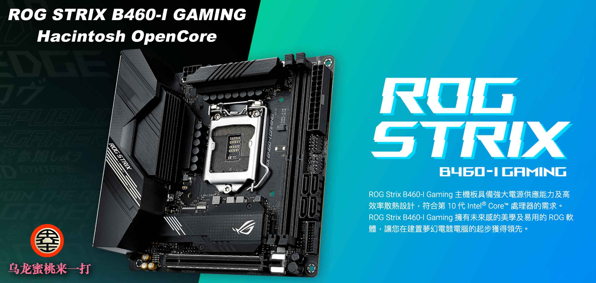
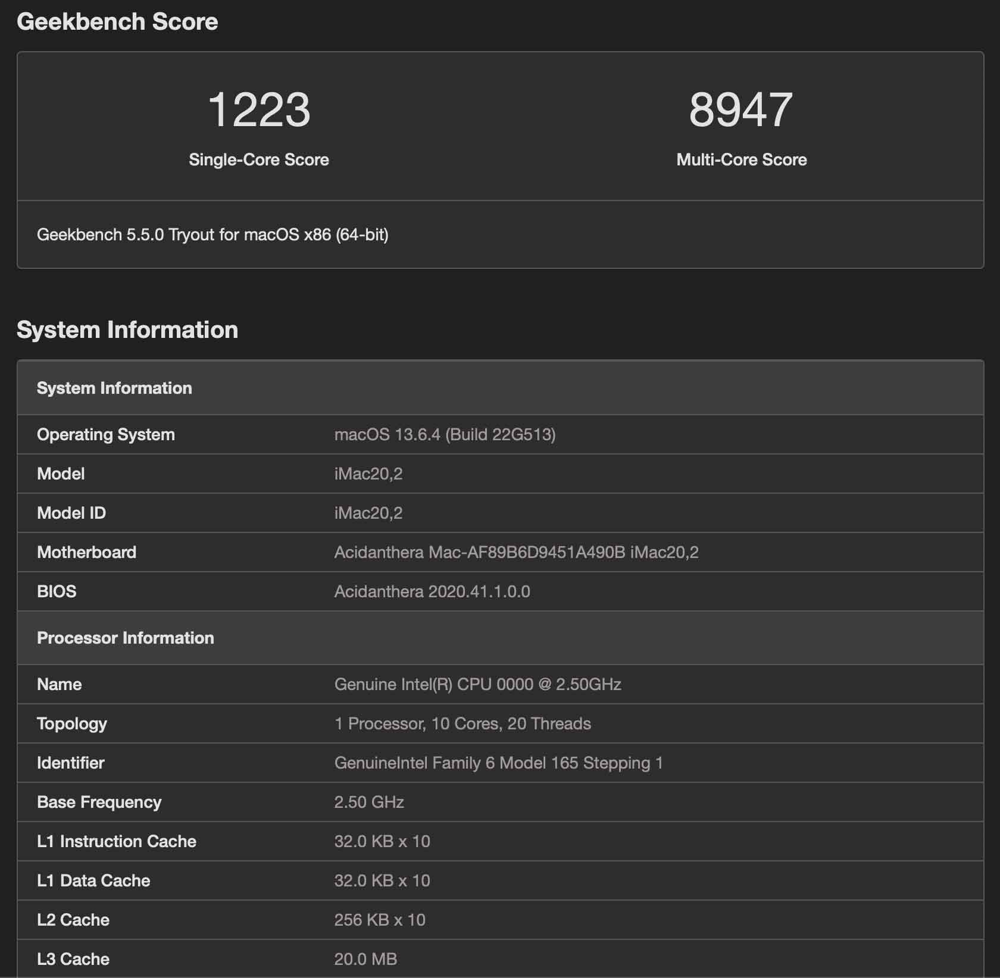
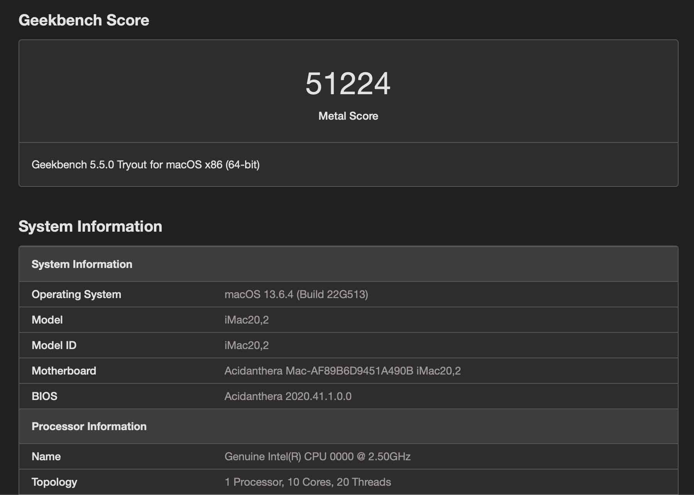
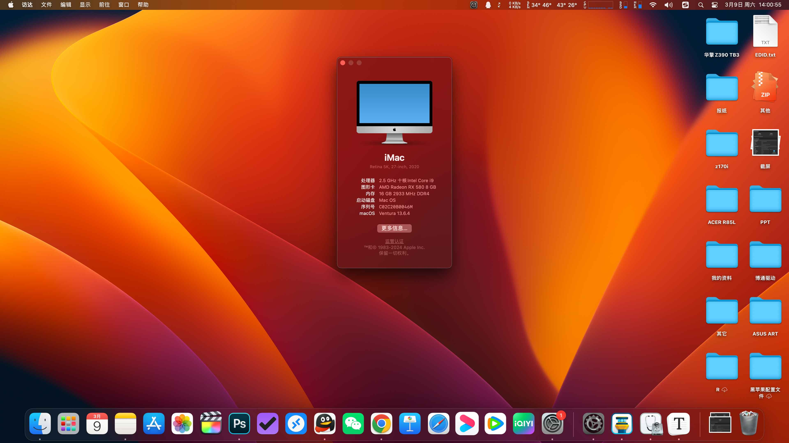

# [ROG-STRIX-B460I-GAMING](https://github.com/hackintosh-club/rog-strix-b460i-gaming-OpenCore) Hackintosh OpenCore EFI

### [简体中文](https://github.com/hackintosh-efi/MAG-B660M-MORTAR-WIFI-DDR4-OpenCore)

[OpenCore 0.9.8](https://github.com/acidanthera/OpenCorePkg)

### OS Version Tested

- macOS Sonoma 14.x
- macOS Ventura 13.6
- macOS Monterey 12.x

### Hardware

- Motherboard: MSI-MAG-B660M-MORTAR-WIFI-DDR4
- Bios Version: 1601（2022/04/06）
- CPU: Intel 10th i9-10900 ES (QTB1)
- RAM: TEAMGROUP 2x8GB DDR4 3200MHz
- SSD: WD_BLACK SN750 500GB MacOS
- SSD: Crucial CT500 MX 500GB Windows
- iGPU: Intel UHD Graphics 630
- GPU: DELL OEM Radeon RX580X 8GB 2304 SP
- Audio: Realtek ALC1220A
- Ethernet: Intel Ethernet Connection I219-V
- Wireless: BCM94360CS2 with m.2 Adaper
- PSU: Channel Well Technology SFX 650W Full module
- CASE:COLORFUL Blacktip Shark S1

### Bios Setup

### 

| Name                      | Option   |      | Name                  | Option   |
| ------------------------- | -------- | ---- | --------------------- | -------- |
| SW Guard Extensions (SGX) | Disabled |      | IOAPIC 24-119 Entries | Disabled |
| VT-d                      | Enabled  |      | Network Stack         | Disabled |
| Above 4G Decoding         | Enabled  |      | XHCI-Hand-Off         | Enabled  |
| Primary Display           | Auto     |      | Fast Boot             | Disabled |
| iGPU-Multi-Monitor        | Enabled  |      | OS Type               | Other OS |
| iGPU-Multi-Monitor        | Enabled  |      | Launch CSM            | Disabled |
| RC6 Standby               | Disabled |      |                       |          |

### Notes

- Use[OCAuxiliaryTools](https://github.com/ic005k/OCAuxiliaryTools/releases) or [OpenCore Configurator](https://mackie100projects.altervista.org/opencore-configurator/) build your SMBIOS

### ScreenShot

- Geekbench5 Score i9-10900 ES (QTB1)

- Geekbench5 Score Metal DELL OEM Radeon RX580X 8GB 2304 SP

- About this Mac

### Contact Us

- QQ Group: 23304408

