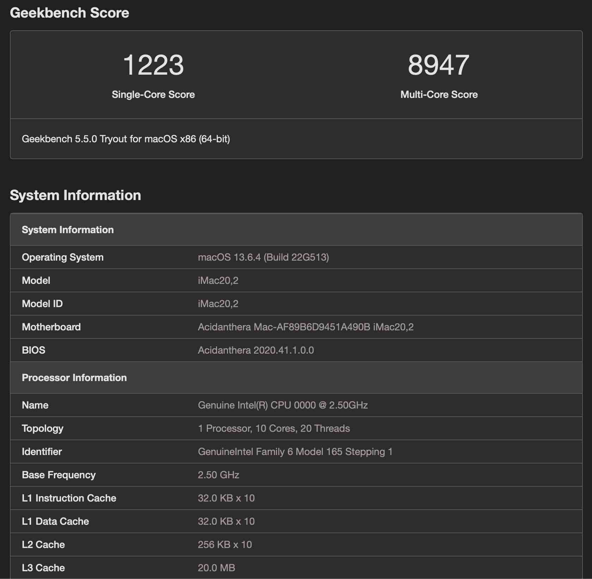
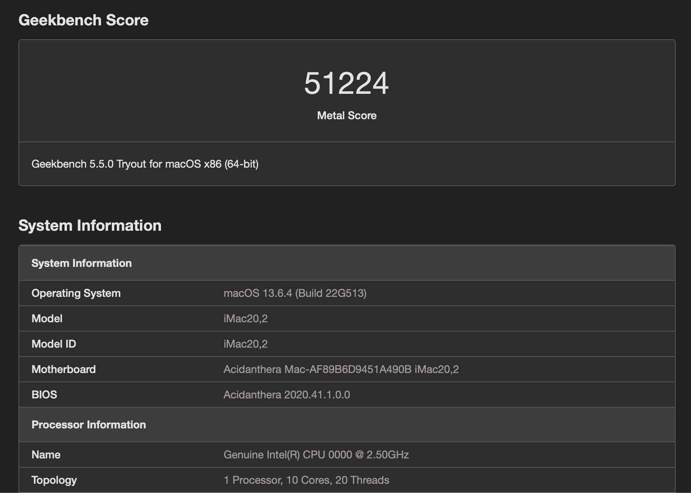

# [ROG-STRIX-B460I-GAMING](https://github.com/hackintosh-club/rog-strix-b460i-gaming-OpenCore)  黑苹果 OpenCore EFI

### [English](README.EN.md)

[OpenCore 0.9.8](https://github.com/acidanthera/OpenCorePkg)

### 可安装系统

- macOS Sonoma 14.x
- macOS Ventura 13.x
- macOS Monterey 12.x

### 硬件

- 主板: ROG-STRIX-B460I-GAMING
- Bios版本: 1601（2022/04/06）
- 处理器: 英特尔10代 i9-10900 ES (QTB1)
- 内存: 十铨火神 2x8GB DDR4 3200MHz
- 硬盘: 1.西数 SN750 500GB MacOS
- 硬盘: 2.美光 CT500 MX 500GB Windows
- 核显: 英特尔超核心显卡630
- 独显: [戴尔 OEM Radeon RX580X 8GB 2304 SP](https://www.bilibili.com/video/BV1r24y1P7iC/) 
- 声卡: 瑞昱 ALC1220A
- 网卡: 英特尔 以太网连接 I219-V
- 无线: BCM94360CS2 搭配 m.2 转接板 （白果拆机卡）
- 电源: 侨威 SFX 650W 全模组
- 机箱: 七彩虹黑鳍鲨S1

### Bios 设置

### 

| 名称                      | 选项 |      | 名称                  | 选项         |
| ------------------------- | ---- | ---- | --------------------- | ------------ |
| SW Guard Extensions (SGX) | 禁用 |      | IOAPIC 24-119 Entries | 禁用         |
| VT-d                      | 启用 |      | 网络堆栈              | 禁用         |
| 大于 4G 地址空间解码      | 启用 |      | XHCI-Hand-Off         | 开启         |
| 首选显卡                  | Auto |      | 快速启动              | 禁用         |
| 初始化iGPU                | 启用 |      | 操作系统类型          | 其它操作系统 |
| DVMT Pre-Allocated        | 64M  |      | 开启CSM               | 禁用         |
| RC6 Standby               | 禁用 |      |                       |              |

### 注意事项

- 使用[OCAuxiliaryTools](https://github.com/ic005k/OCAuxiliaryTools/releases) 或 [OpenCore Configurator](https://mackie100projects.altervista.org/opencore-configurator/) 生成 SMBIOS

### 系统截图

- Geekbench5 跑分 i9-10900 ES (QTB1)

- Geekbench5 跑分 Metal 戴尔 OEM Radeon RX580X 8GB 2304 SP

- 关于本机

### 联系我们

- QQ群: 23304408

